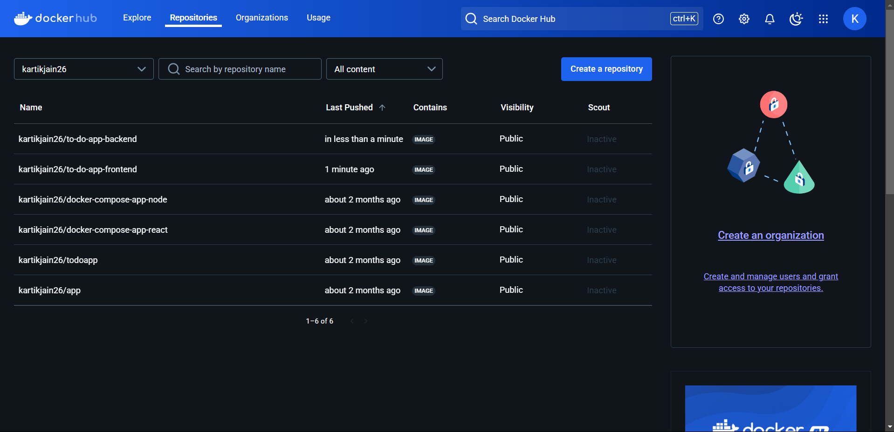
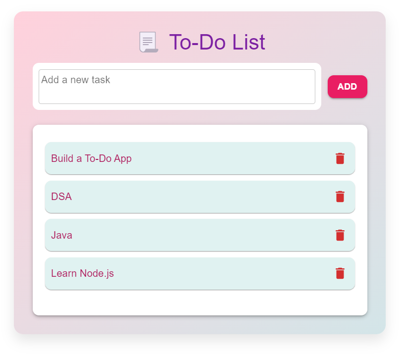

---

# 🚀 To-Do App (Dockerized) 📝

This is a simple **To-Do List Application** with a **frontend** built using **React.js** and a **backend** using **Node.js**. The application is **Dockerized** using **Docker Compose** to manage the containers for both frontend and backend.

## ✨ **Features** 
- Add, edit, and delete tasks.
- Persistent task data stored in the backend (without MongoDB, using a simple in-memory store).
- Fully dockerized application with frontend served using React and backend using Node.js.

---

## 🛠️ **Technologies Used** 

### Frontend:
- **React.js** for building the user interface.
- **Material-UI** for UI components and styling.
- **Axios** for making API calls to the backend.

### Backend:
- **Node.js** as the runtime for backend development.
- **Express.js** for building the RESTful API.
- **CORS** for handling cross-origin requests.

### Docker:
- **Docker Compose** for managing both frontend and backend containers.

---

## 📂 **Folder Structure**

```
To-Do-App/
│
├── Assets/                      # New folder for images
│   ├── DockerHub.png            # DockerHub image
│   └── To-Do-List-APP.png       # To-Do List App image
│
├── backend/                     # Backend directory (Node.js API)
│   ├── .gitignore               # Git ignore file for backend
│   ├── Dockerfile               # Dockerfile for the backend
│   ├── index.js                 # Backend Node.js server
│   ├── package.json             # Backend dependencies
│   ├── package-lock.json        # Backend lock file
│   ├── server.js                # Backend server
│   └── todos.json               # Todo data file (JSON)
│
├── frontend/                    # Frontend directory (React app)
│   ├── .gitignore               # Git ignore file for frontend
│   ├── Dockerfile               # Dockerfile for the frontend
│   ├── README.md                # Frontend readme file
│   ├── package-lock.json        # Frontend lock file
│   ├── package.json             # Frontend dependencies
│   ├── public/                  # Public folder (React)
│   │   ├── favicon.ico          # React app favicon
│   │   ├── index.html           # Main HTML file
│   │   ├── logo192.png          # Logo image for React
│   │   ├── logo512.png          # Logo image for React
│   │   ├── manifest.json        # App manifest
│   │   └── robots.txt           # Robots.txt file
│   └── src/                     # Source folder (React components)
│       ├── App.css              # App CSS
│       ├── App.js               # App component
│       ├── App.test.js          # App tests
│       ├── components/          # React components
│       │   └── TodoList.js      # Todo List component
│       ├── index.css            # Main CSS for the React app
│       ├── index.js             # Entry point for React
│       ├── logo.svg             # React logo
│       ├── reportWebVitals.js   # Web vitals for performance metrics
│       └── setupTests.js        # Test setup
│
├── docker-compose.yml           # Docker Compose file for backend & frontend
├── package-lock.json            # Lock file for the entire project
└── package.json                 # Dependencies for the entire project (if applicable)
└── README.md                    # Project documentation (root-level)

```

---

## 🏡 **Setting Up the Project Locally** 

To run this project locally, follow these steps:

### 📥 **Step 1 : Clone the Repository**
Clone the repository to your local machine:

```bash
git clone :  https://github.com/Kartikk-26/Dockerized-To-Do-App-.git
cd To-Do-App
```

###  🐋 **Step 2: Install Docker**

If you haven't installed **Docker** on your machine yet, you can download it from [here](https://www.docker.com/products/docker-desktop).

### 🏗️ **Step 3: Build the Docker Containers**

Run the following command to build the frontend and backend Docker containers:

```bash
docker-compose build
```

### ▶️ **Step 4: Run the Application**

After building the containers, start the application by running:

```bash
docker-compose up
```

This will start both the frontend and backend services.

- The frontend will be available at `http://localhost:3000`.
- The backend will be available at `http://localhost:5000`.

---

## ⏹️ **Stop the Application**

To stop the containers, run:

```bash
docker-compose down
```

---

## 🛠️ **Dockerized Services**

- **Backend**: The backend service is built using **Node.js** and **Express**. It handles task CRUD operations and serves the API at `http://localhost:5000`.
  
- **Frontend**: The frontend service is built using **React.js**. It interacts with the backend API to display and manage tasks. It is served at `http://localhost:3000`.

---

## 🌐 **Ports Mapping**

- **Frontend** is mapped to `localhost:3000`.
- **Backend** is mapped to `localhost:5000`.

---

## 📋 **To-Do App Functionality**

1. **Add a Task**: Type the task in the input field and click "Add Task" to save it.
2. **Delete a Task**: Click on the trash icon next to any task to remove it from the list.
3. **Edit a Task**: Update an existing task and hit "Save".

---

## ⚙️ **Customization**

You can modify the `docker-compose.yml` file to use different ports or customize other services as needed.

---

### Example Screenshot 📸:
-> Docker-Hub-Record


-> To-Do-List-Application


---

## 💡 Connect with Me

Stay connected on [LinkedIn](https://www.linkedin.com/in/-kartikjain/) to see more projects and improvements as I continue my learning journey. 

Let's collaborate and create impactful web applications! 

---